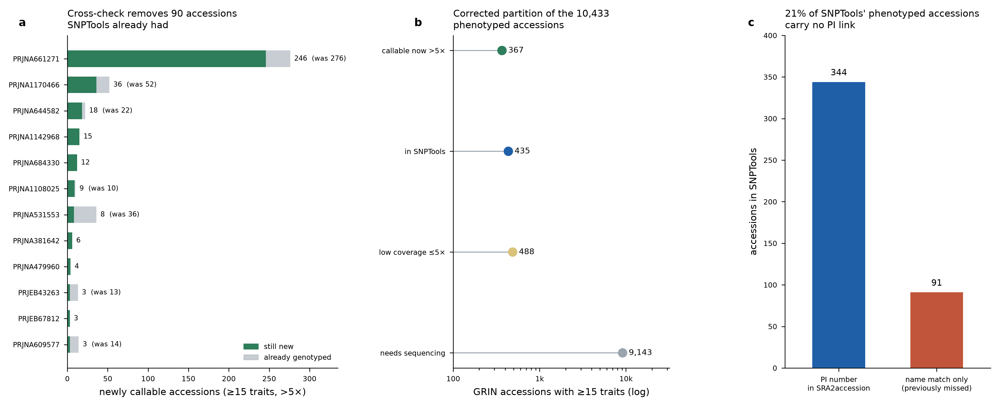

# SNPTrait — GRIN phenotype × public WGS coverage analysis

Linking USDA-ARS National Plant Germplasm System (GRIN) maize phenotype records to SNPTools genotypes, and finding which phenotype-rich accessions already have public whole-genome sequence.

All numbers were computed from the input files and from live queries to the ENA Portal API, NCBI E-utilities, and EVA. Nothing is estimated.

---

## Headline results

| | |
|---|---|
| GRIN accessions with ≥15 phenotyped traits | **10,433** |
| …already genotyped in SNPTools | **435** |
| …with public WGS >5× — **variant-callable now** | **367** (315 at ≥10×, 52 at 5–10×) |
| …with public data ≤5× — impute or top-up | 488 |
| …no public sequence — must be genotyped | 9,143 |
| Public FASTQ needed for the 367 | **1,420 files / ~15.8 TB** across 77 projects |
| Name-matcher accuracy vs. PI-number truth links | **335 / 335 (100%)** |

Median phenotype depth of the 435 genotyped accessions: **29 distinct traits** (max 48, B73). The single largest sequencing opportunity is **`PRJNA661271`, the Maize Wisconsin Diversity Panel Resequencing Project — 246 new callable phenotyped accessions in one project.**



---

## Two findings that changed the numbers

Both are reproducibility warnings, not incidental details. Either one, missed, produces a wrong build plan.

### 1. Deep whole-genome data hides under non-`WGS` strategy labels

A conventional discovery query filters `library_strategy="WGS"`. Across the *Zea* subtree that silently drops:

| library_strategy | runs | total bases |
|---|---|---|
| `WGS` | 25,132 | 315.7 Tb |
| `OTHER` | 13,313 | 29.0 Tb |
| `WXS` | 1,987 | 1.7 Tb |
| `WGA` | 1,262 | **30.9 Tb** |

`WGA` averages ~24 Gb per run — deeper than the `WGS` mean. **`PRJNA661271` (WiDiv resequencing), the largest single source of callable phenotyped accessions in the archive, is registered as `WGA`.** A `WGS`-only query drops all 458 of its runs and 246 accessions with them.

**Filter on `library_source="GENOMIC"`, accept `WGS OR WGA OR WXS OR OTHER`, then filter on measured depth from `base_count`.** Never on the strategy label alone.

### 2. "Already genotyped" cannot be inferred from PI numbers

The first pass defined SNPTools membership from PI numbers in `SRA2accession.tsv`. Cross-checking against the canonical `SNPTools_accession_list.tsv` showed why that fails.

The two files describe the **same 2,710 runs** — identical run-ID sets, and the only name differences are replicate suffixes (`B73_v5rep1` vs `B73`). Nothing was missing. But **only 384 of 2,332 SNPTools names ever received a PI number**, so an accession genotyped under an unlinked plant name looked un-genotyped.

Re-matching every SNPTools name to GRIN recovered **91 accessions SNPTools already holds — 21% of its phenotyped membership. 90 of them were sitting in the "callable now" build queue** and would have been re-called redundantly.

| | before | after |
|---|---|---|
| already in SNPTools | 344 | **435** |
| callable now >5× | 457 | **367** |
| low coverage ≤5× | 488 | 488 |
| needs sequencing | 9,144 | 9,143 |
| priority FASTQ | 2,076 files / 20.3 TB | **1,420 files / 15.8 TB** |

Three projects account for 49 of the 90 removals: `PRJNA531553` (521 runs already in SNPTools, 36 → 8 targets), `PRJNA609577` (453 runs, 14 → 3), `PRJEB31061` (77 runs, 11 → 1). `PRJEB56320` — the correctly-labelled WiDiv subset study — drops out entirely.

The other 41 came from projects **not** in the SNPTools list at all, including 30 from WiDiv itself: the same accession is genotyped in SNPTools from a different project's reads. **Project-level exclusion is not sufficient — the check must be per accession.**

`view19_snptools_list_grin_crosswalk.csv` is the crosswalk this produced and the file to maintain going forward.

---

## Top projects by newly callable accessions

| project_id | study title | strategy | new >5× & ≥15tr | was | TB |
|---|---|---|---|---|---|
| `PRJNA661271` | Maize Wisconsin Diversity Panel Resequencing Proje | WGA | **246** | 276 | 6.4 |
| `PRJNA1170466` | Genome resequencing data of 447 maize inbred lines | WGS | **36** | 52 | 0.3 |
| `PRJNA644582` | The maize structural variation map uncovered by Na | WGS | **18** | 22 | 2.2 |
| `PRJNA1142968` | Evaluation of genetic diversity across the inbreds | WGS | **15** | — | 0.2 |
| `PRJNA684330` | Maize diversity to study rare alleles | WGS | **12** | — | 0.1 |
| `PRJNA1108025` | Zea mays Raw sequence reads | WGS | **9** | 10 | 0.1 |
| `PRJNA531553` | Deep DNA resequencing of the association mapping p | WGS | **8** | 36 | 0.2 |
| `PRJNA381642` | Zea mays subsp. mays Genome sequencing | WGS | **6** | — | 0.3 |
| `PRJNA479960` | South American maize genome sequencing | WGS | **4** | — | 0.1 |
| `PRJEB43263` | EM-Seq for NAM lines with 2 replicates | OTHER | **3** | 13 | 0.1 |
| `PRJEB67812` | Whole-genome sequencing and de novo assembly of 29 | WGS | **3** | — | 0.2 |
| `PRJNA609577` | Zea mays subsp. mays Genome sequencing | WGS | **3** | 14 | 0.0 |
| `PRJNA1123779` | GBS sequencing of maize NAM population-1 | WGS | **3** | 4 | 0.0 |
| `PRJNA168265` | Zea mays subsp. mays Genome sequencing | WGS | **2** | — | 0.2 |
| `PRJNA1196311` | maize-HKW | WGS | **2** | 3 | 0.0 |

Blank in "was" means the cross-check changed nothing for that project. All 235 projects with ≥1 matched accession: `data/view13_project_summary_all.csv`. The 77 with genuinely new high-coverage targets: `data/view14_projects_with_highcov_targets.csv`.

---

## Downloading the FASTQ files

```bash
# one project first — WiDiv, 492 files / 6.4 TB / 246 accessions
./scripts/fetch_fastq.sh data/fastq_urls_by_project/PRJNA661271.txt ./fastq 4

# or the whole priority build (1,420 files, ~15.8 TB)
./scripts/fetch_fastq.sh data/fastq_urls_priority_build.txt ./fastq 4

# verify against manifest md5s
python3 scripts/verify_md5.py data/view16_fastq_manifest_priority_build.csv ./fastq
```

URL lists are plain ENA FTP paths, one per line — usable directly with `aria2c -i`, `wget -i`, or `xargs curl`. Every manifest row carries `fastq_md5` and `file_bytes` plus the GRIN accession, plant name, trait count, and sample coverage the file belongs to, so you can subset by phenotype depth before downloading anything.

---

## Repository contents

### Figures (`figures/`)

| file | content |
|---|---|
| `fig1_snptools_trait_coverage.png` | Trait coverage of the 435 genotyped accessions; per-accession trait depth; pairwise joint coverage of the ten deepest multi-environment traits |
| `fig2_expansion_and_metadata.png` | Tier composition by germplasm panel; trait depth vs. sequence depth for the 367 callable accessions; queryable-metadata fill rates |
| `fig5_snptools_crosscheck_correction.png` | Corrected project ranking, corrected partition, and PI-link vs. name-only evidence |

Figures 3 and 4 from earlier drafts have been removed: `fig3` reflected the `WGS`-only query and `fig4` the PI-only SNPTools basis. Both are superseded by `fig5` and were deleted rather than retained, to prevent a stale figure being cited.

### Coverage analysis

| file | content |
|---|---|
| `view1_snptools_accession_trait_depth.csv` | All 435 genotyped accessions: traits measured, total trait-environments, deepest trait, traits with ≥2 environments, PI-link vs. name-match evidence, GRIN metadata |
| `view2_trait_coverage_ranked_by_snptools.csv` | Every trait ranked by how many of the 435 carry it, with max and mean environment depth and the all-GRIN comparison |
| `view3_snptools_x_trait_env_matrix.csv` | The 435 × 130 environment-count matrix |
| `view4_trait_pairwise_joint_coverage.csv` | Joint coverage for every pair of the ten deepest multi-environment traits |
| `view5_candidate_expansion_panels.csv` | Per-panel tier breakdown with pedigree and origin fill rates |
| `view6_candidate_accessions_not_in_snptools.csv` | All 9,998 candidates, priority-ranked, with tier and best available depth |
| `view7_recoverable_sra_grin_links.csv` | 115 name-recoverable SRA↔GRIN links, flagged for whether the corrected basis already adopted them (90 did) |
| `view8_metadata_field_profile.csv` | Fill rate, cardinality, and recommended role for each metadata field |
| `view9_snptools_rows_needing_curation.csv` | 8 SNPTools-matched accessions with no row in the observation summary |

### Public WGS discovery

| file | content |
|---|---|
| `view10_public_wgs_build_queue.csv` | Per-accession build queue: depth, contributing studies, matched field, priority score |
| `view11_curator_queue_ambiguous_wgs.csv` | 343 samples matching ambiguously but carrying ≥5× — each resolution is a free accession |
| `view12_eva_genotyped_no_wgs.csv` | 71 accessions genotyped in EVA with no WGS reads anywhere — genotype-import candidates |
| `view13_project_summary_all.csv` | All 235 projects with matched accessions: samples, runs, TB, strategies, accession counts by category |
| `view14_projects_with_highcov_targets.csv` | The 77 projects with genuinely new >5× accessions, with before/after cross-check counts |
| `view15_fastq_manifest_highcov.csv` | Every FASTQ for all 7,727 samples >5× — 28,803 files, 176.7 TB, with md5 and byte size |
| `view16_fastq_manifest_priority_build.csv` | Priority subset: 1,420 files / 15.8 TB for the 367 callable accessions |
| `view17_highcov_samples.csv` | The 7,727 samples >5× with their matched accession and depth |
| `view18_accessions_needing_sequencing.csv` | Phenotyped accessions with no public sequence — the de novo genotyping list |

### Cross-check and provenance

| file | content |
|---|---|
| `view19_snptools_list_grin_crosswalk.csv` | **Every SNPTools run → GRIN accession**, with normalized key, ambiguity count, risky-key flag, and whether a PI link existed |
| `view20_snptools_accessions_missed_by_pi_link.csv` | The 91 accessions the PI-only basis missed |
| `view21_corrected_tier_assignment.csv` | **Authoritative** corrected tier for all 10,433 phenotyped accessions, with `snptools_evidence` |
| `view22_snptools_names_unmatched_to_grin.csv` | **1,833 SNPTools names with no GRIN plant-name match** — the curation backlog |
| `SNPTools_accession_list.tsv` | The canonical SNPTools list used for the cross-check |
| `ena_maize_wgs_run_metadata.tsv` | Raw 41,694-run ENA pull, refreshable in one API call |

### Reports and scripts

`SNPTrait_assessment_and_plan.md` — coverage assessment, expansion candidates, metadata recommendations, build order.
`SNPTrait_public_WGS_discovery_strategy.md` — the archive-discovery method: query, matcher rules, validation, EVA assessment.
`scripts/fetch_fastq.sh` — parallel resumable download (`aria2c`, `wget` fallback).
`scripts/verify_md5.py` — checksum verification against a manifest.

---

## The curation backlog

**1,833 of 2,332 SNPTools names have no GRIN plant-name match** (`view22`). Until that closes, SNPTrait cannot reliably answer "do I already have this genotype?" — the exact question whose wrong answer produced the 90-accession error above. Adding PI numbers to those names is the highest-value curation task in this project.

The unmatched names fall into recognizable classes: proprietary or commercial designations (`NK907`, `NKBCC03`), internal sample codes (`S50676`, `S160`), and non-GRIN research lines. Five appear truncated at exactly 15 characters (`TZU-CHIAO-HSI-W`, `SEAGULLSEVENTEE`, `NY_166__NEVEH_Y`), suggesting a field-width limit somewhere upstream — worth checking at the source, since a truncated name cannot match.

---

## Method caveats

- The phenotype input counts **environments, not trait values**. Its row key is labelled as a germplasm name but holds an accession number. `Notes and Remarks`, `Core Subset`, and `Primary Race` are classification columns, excluded from all trait counts.
- Sequence depth is `base_count / 2.3 Gb` — a **yield proxy** ignoring duplication, read quality, and mapping rate. Realized depth after alignment is lower. Treat 5× as a soft floor; the 315 accessions at ≥10× are the safe set.
- Accession↔sample links rest on **name matching**, because almost no archive record cites a germplasm accession number. Normalization: uppercase, strip a leading `Zea mays [subsp. mays]`, drop `INBRED`/`LINE`/`CULTIVAR`/`MAIZE`/`ACCESSION`, remove whitespace and punctuation. Field preference: `cultivar` → `strain` → `isolate` → `ecotype` → `sample_alias` → `sample_title` → `description`. Purely numeric or <3-character keys are quarantined regardless of uniqueness; so is any key mapping to more than one GRIN accession.
- The matcher validated **335/335** against PI-number truth links. That control does **not** extend to the quarantined ambiguous tier, and by construction it is unavailable for the 91 recovered accessions — those rest on name matching alone (`view20` lists them for spot-checking).
- The large unmatched archive remainder is dominated by CUBIC, BT, MT, and NAM-derived RIL populations — segregating progeny, not germplasm accessions. They correctly should not match.
- GRIN duplicate records (one plant name under several accession numbers, e.g. `P39` as `NSL 8585`, `PI 587133`, `PI 692185`, `PI 690333`) are excluded from matching, not resolved.

**Provenance fields any downstream database must store and surface:** `match_method` per accession↔sample link (`pi_exact` / `name_unique_validated` / `curator_resolved`) and `depth_tier` per genotype. A user comparing a 76× reference inbred to a 5× imputed line needs to see that difference.

---

## Reproducing

The ENA pull is a single request:

```bash
curl -G "https://www.ebi.ac.uk/ena/portal/api/search" \
  --data-urlencode "result=read_run" \
  --data-urlencode 'query=tax_tree(4577) AND library_source="GENOMIC" AND (library_strategy="WGS" OR library_strategy="WGA" OR library_strategy="WXS" OR library_strategy="OTHER")' \
  --data-urlencode "fields=run_accession,sample_accession,study_accession,sample_alias,sample_title,description,cultivar,ecotype,strain,isolate,library_strategy,instrument_platform,read_count,base_count,study_title,center_name,fastq_ftp,fastq_bytes,fastq_md5" \
  --data-urlencode "format=tsv" --data-urlencode "limit=0" -o ena_geno.tsv
```

Public maize sequence grows fast enough that this is worth re-running quarterly. The matcher is deterministic, so the queue refills on its own.

## Data sources

- USDA-ARS GRIN Global / National Plant Germplasm System — germplasm records and phenotype observations
- ENA Portal API (EMBL-EBI) — run and sample metadata, FASTQ URLs
- NCBI SRA / BioProject (E-utilities) — cross-checks and project discovery
- EVA (European Variation Archive) — existing variant-call studies

Sequence data referenced here belongs to its original submitters; cite the individual BioProjects when using it.
