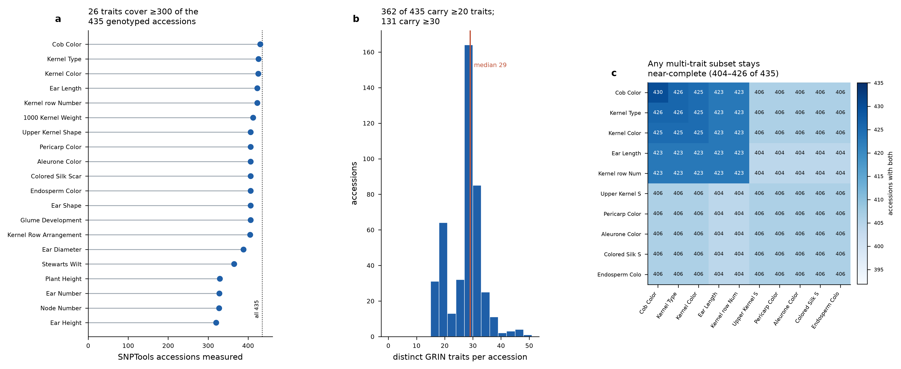
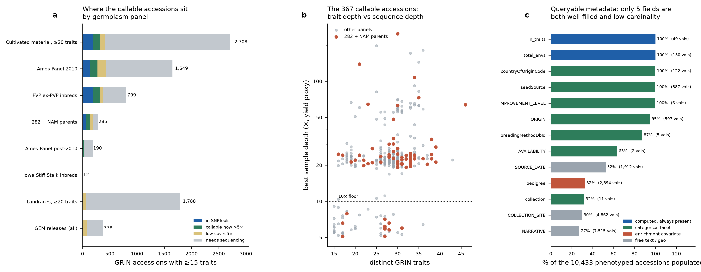

# SNPTrait — coverage assessment and build plan

*All numbers computed from the input files and from live ENA / NCBI / EVA queries. Nothing estimated.*

**Inputs analyzed:** `SNPTools_accession_list.tsv` (2,710 runs, 2,332 distinct names, 18 BioProjects — the canonical SNPTools list), `SRA2accession.tsv` (same 2,710 runs, adds a PI number where one was matched), `combined_GRIN_accessions.tsv` (42,045 GRIN records), `maize_germplasm.tsv` (24,286 BrAPI germplasm records), `observation_envs_by_accession.csv` (24,286 accessions × 130 traits + 3 classification columns).

---

## 1. Is there enough data for a public prototype?

**Yes, comfortably — and the constraint is not phenotype coverage.**

**435 GRIN accessions are genotyped in SNPTools and every one of them has phenotype records.** Those 435 carry a **median of 29 distinct traits each** (mean 27.0, max 48 for B73), representing **11,742 measured trait × accession cells and 25,984 accession-trait-environment observations**. 362 of the 435 carry ≥20 traits; 131 carry ≥30.

The prototype-critical property is that the panel does not shatter under filtering. **26 traits are measured on ≥300 of the 435 accessions and 28 on ≥200.** Among the ten deepest multi-environment traits, **pairwise joint coverage never drops below 404 of 435** — so a user who filters on several traits at once still gets a near-complete panel, not a handful of survivors. That is the difference between a demo and a usable tool.

**What the phenotype data is and is not.** The observation summary counts *environments per trait × accession*, not trait values. SNPTrait can answer "which accessions were measured for ear length, and how intensively" but not "which accessions have ear length > 15 cm" until the underlying values are pulled from GRIN. Roughly half the well-covered traits are categorical descriptors (cob colour, kernel type, aleurone colour) rather than quantitative measurements. **Six traits reach 25–70 environments; the median measured cell is 1–3 environments.** For a v1 prototype the environment counts are enough to build and demonstrate every query path; for real allele mining you will want the values.

---

## 2. The genotyping universe

Of the **10,433 GRIN accessions with ≥15 phenotyped traits**:

| tier | n | action |
|---|---|---|
| already in SNPTools | **435** | done |
| public WGS >5× — callable now | **367** | call variants (315 at ≥10×, 52 at 5–10×) |
| public data ≤5× | 488 | impute or top-up sequencing |
| no public sequence | 9,143 | de novo genotyping |

The 367 callable accessions need **1,420 FASTQ files / ~15.8 TB** across 77 projects. `view21_corrected_tier_assignment.csv` is the authoritative partition.

---

## 3. Expansion candidates — accessions not in SNPTools with good trait data

`view6_candidate_accessions_not_in_snptools.csv` ranks all 9,998, priority-scored on trait depth, callability, and panel membership. By panel:

| panel | ≥15tr total | in SNPTools | callable now | ≤5× | needs seq |
|---|---|---|---|---|---|
| Cultivated material, ≥20 traits | 2,708 | 194 | 134 | 81 | 2,299 |
| Ames Panel 2010 | 1,649 | 141 | 134 | 157 | 1,217 |
| PVP ex-PVP inbreds | 799 | 191 | 130 | 57 | 421 |
| 282 + NAM parents | 285 | 66 | **73** | 45 | 101 |
| Ames Panel post-2010 | 190 | 5 | 20 | 8 | 157 |
| Landraces, ≥20 traits | 1,788 | 0 | 0 | 61 | 1,727 |
| GEM releases (all) | 378 | 0 | 0 | 87 | 291 |

**Take 282 + NAM parents first.** 73 callable accessions, median 30 traits, median 54 trait-environments — the highest phenotype depth per accession anywhere in the collection, and pedigree is populated for 94.5% of them. Highest-value individuals: B96 (PI 270297, 46 traits, 64×), W64A (PI 587152, 39 traits, 28×), IDS91 (PI 686063, 39 traits, 21×), H99 (PI 587129, 38 traits, 23×), Va102 (PI 587151, 38 traits, 25×).

**The landrace block is the strategic opportunity and the expensive one.** 1,788 landraces carry ≥20 traits and *none* are in SNPTools; 1,727 have no public sequence at all. They are also the only group with meaningful geographic coordinate coverage, which makes them the natural target for environmental-association work — but they require de novo genotyping, so they belong in a grant, not in v1.

---

## 4. Metadata worth querying on

Only five fields are both well-populated across the phenotyped universe and low-cardinality enough to facet on: `IMPROVEMENT_LEVEL` (100%, 6 values), `countryOfOriginCode` (100%, 122), `breedingMethodDbId` (87%, 5), `AVAILABILITY` (63%, 2), and `collection` (32%, 11 — sparse but the most useful, since it encodes panel membership). `ORIGIN` is 95% filled but has 597 values; it needs normalizing before it can be a facet.

`pedigree` (32%, 2,894 values) is the highest-value enrichment covariate — free text, so it needs parsing, but heterotic-group and founder inference come from it. `COLLECTION_SITE` (30%) and `NARRATIVE` (27%) are free text: index them for search, don't facet on them.

**Two fields SNPTrait must add, which no input file carries:** `match_method` per accession↔sample link (`pi_exact` / `name_unique_validated` / `curator_resolved`) and `depth_tier` per genotype. Both belong in the UI. A user comparing a 76× reference inbred to a 5× imputed line needs to see that difference, and a user relying on a name-based link needs to know it was not a PI-number match.

---

## 5. The bidirectional query paths

**Phenotype → genotype.** Filter accessions by trait presence, environment depth, panel, improvement level, or origin → export the accession set → hand to variant analysis. The joint-coverage result above is what makes this work: the exported set stays large under multi-trait filtering.

**Genotype → phenotype.** Take an accession set from variant analysis or allele mining → return its trait profile, environment depth, and metadata distribution → test for enrichment against the rest of the panel. With 435 genotyped accessions and 26 traits at ≥300 coverage, enrichment tests have real power on the categorical descriptors. Quantitative traits will need the values, not the environment counts.

---

## 6. Build order

1. **Load the corrected tier table and crosswalk.** `view21` and `view19` are the spine. Without the crosswalk, SNPTrait cannot answer "do I already have this genotype?" — exactly the question that produced the 90-accession error documented in the README.
2. **Complete the crosswalk.** 1,833 of 2,332 SNPTools names have no GRIN key. This is the highest-value curation task in the project.
3. **Pull GRIN trait values,** not just environment counts. Everything quantitative depends on this.
4. **Call the 367.** Start with WiDiv (`PRJNA661271`, 492 files, 6.4 TB, 246 accessions) — 67% of the opportunity in one download.
5. **Then decide what to sequence.** Doing 1–4 first removes ~370 accessions from the sequencing list and changes the answer.

---

## 7. View tables

| file | content |
|---|---|
| `view1_snptools_accession_trait_depth.csv` | One row per genotyped accession (all 435): traits measured, total trait-environments, deepest trait, traits with ≥2 environments, PI-link vs name-match evidence, plus GRIN metadata. **The accessions-and-how-many-environments view.** |
| `view2_trait_coverage_ranked_by_snptools.csv` | Every trait ranked by how many of the 435 carry it, with max and mean environment depth, and the all-GRIN comparison. **The trait-environments-sorted-by-SNPTools-accessions view.** |
| `view3_snptools_x_trait_env_matrix.csv` | The 435 × 130 environment-count matrix, subsettable directly |
| `view4_trait_pairwise_joint_coverage.csv` | Joint coverage for every pair of the ten deepest multi-environment traits |
| `view5_candidate_expansion_panels.csv` | Per-panel tier breakdown with pedigree and origin fill rates |
| `view6_candidate_accessions_not_in_snptools.csv` | All 9,998 candidates, priority-ranked, with tier and best available depth |
| `view8_metadata_field_profile.csv` | Fill rate, cardinality, and recommended role for every metadata field |
| `view19_snptools_list_grin_crosswalk.csv` | Every SNPTools run → GRIN accession, with ambiguity count and PI-link flag |
| `view20_snptools_accessions_missed_by_pi_link.csv` | The 91 accessions the PI-only basis missed |
| `view21_corrected_tier_assignment.csv` | Corrected tier for all 10,433 phenotyped accessions |
| `view22_snptools_names_unmatched_to_grin.csv` | The 1,833-name curation backlog |

---

## 8. Caveats

- The phenotype input counts **environments, not trait values**. Its row key is labelled as a germplasm name but holds an accession number.
- `Notes and Remarks`, `Core Subset`, and `Primary Race` are classification columns in that file, excluded from all trait counts.
- Sequence depth is `base_count / 2.3 Gb` — a **yield proxy** that ignores duplication, read quality, and mapping rate. Realized depth after alignment is lower. Treat 5× as a soft floor; the 315 accessions at ≥10× are the safe set.
- Accession↔sample links rest on **name matching**, because almost no archive record cites a germplasm accession number. The matcher validated **335/335** against PI-number truth links, but that control does not extend to the quarantined ambiguous tier.
- GRIN duplicate records (the same plant name under multiple accession numbers) are excluded from matching, not resolved. They need a curator.
